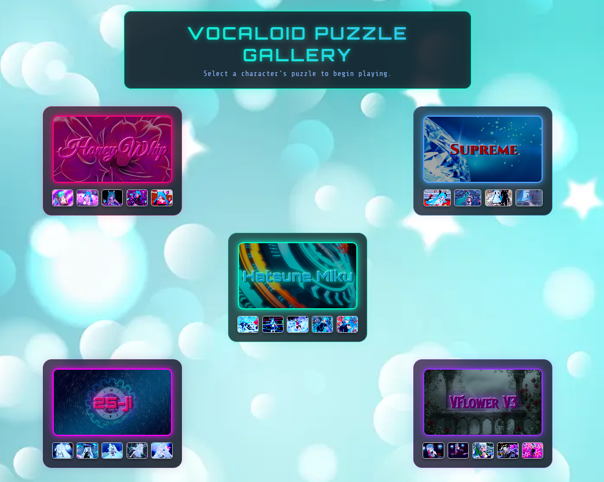
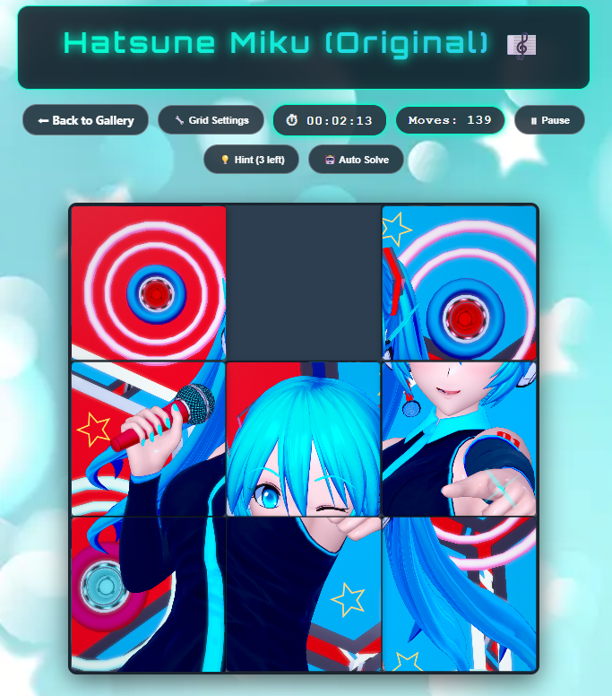
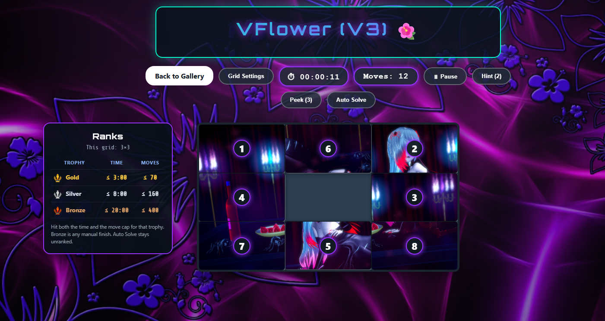
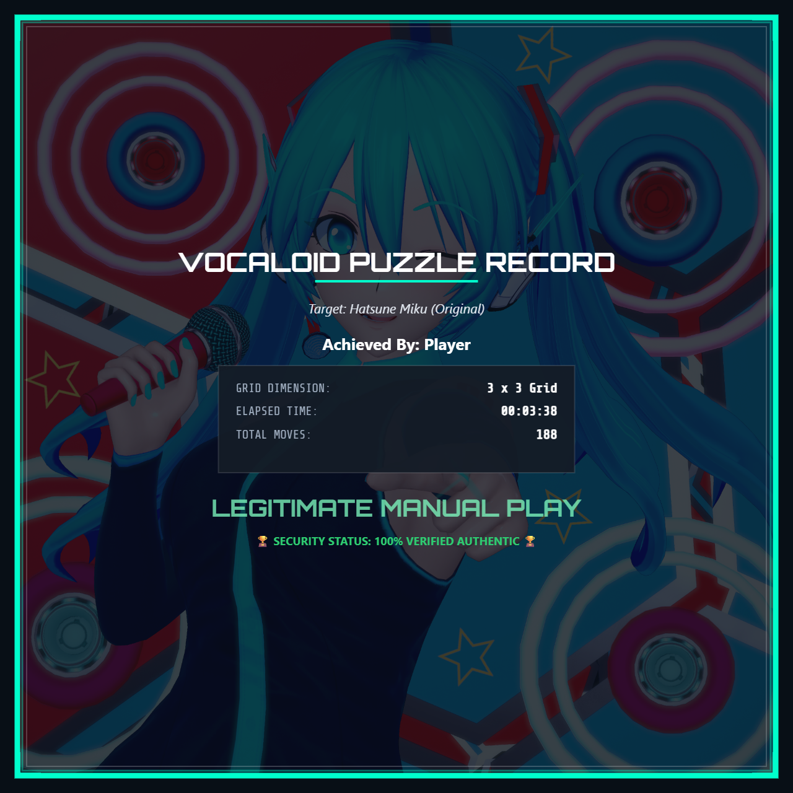

# ボーカロイド スライディングパズル

*[English version is here](README.md)*

初音ミク（いくつかのモジュール）と **VFlower V3** のイラストで遊ぶ、無料・非公式のスライディングパズルです。キャラを選んで絵を選んで、崩れたタイルを元の位置に戻してください。

ブラウザだけで動きます。インストールもアカウントも広告もありません。クリア記録は、遊んだ端末のブラウザに残ります。

**プレイ:** [GitHub Pages](https://cns1700.github.io/Vocaloid-Sliding-Puzzle-/) · [itch.io](https://mizuchisylph.itch.io/vocaloid-sliding-puzzle)

## スクリーンショット

<!-- PNG を screenshots/ に同じファイル名で入れてください。 -->

| | |
|---|---|
|  |  |
| **ギャラリー選択画面** | **パズルプレイ中** |
|  |  |
| **ヒント表示中** | **クリア＆証明書** |

## できること

テーマは5つです。オリジナルミク、Supreme、Honey Whip、25時、VFlower V3。盤面は 3×3 から 8×8 まで、行と列は別々に変えられます。ギャラリーはサイコロ型ではなく、キャラごとに横一列のリストです。

ホームではキャラ背景がゆっくり切り替わります。パズル画面では、そのキャラの背景のまま、光がゆるく動きます。

タイマー、手数、一時停止、番号ヒントに加えて、完成絵を一瞬出す **Peek** があります。日付が変わると **今日のステージ** も変わります。その日は、同じタイムゾーンなら全員同じイラストとグリッドです。

自分でクリアしたパズルはギャラリーが覚えます。サムネにトロフィーが付き、タイムと手数の自己ベストがこのブラウザに残ります。オートソルブでも盤面は揃いますが、ランクには入りません。

クリア後は結果の証明書をダウンロードしたりコピーしたりできます。手動クリアはゴールド／シルバー／ブロンズです。証明書の RANK は「トロフィー | SILVER」の形です。オートソルブは「ランクなし」です。パズル画面の横の表に、その盤面のタイムと手数の条件が出ます。今週のトロフィー数と週／月／年のコレクション証明書はホームにあります。

## 遊び方

1. ギャラリーのサムネを開くか、**今日のパズルをプレイ** を押します。
2. 空白の隣のタイルだけスライドできます。
3. 全部のタイルを正しい位置に戻せばクリアです。

操作：

- **グリッド設定** — 行・列 3〜8（開いている間はタイマー停止）
- **一時停止** — 時計を止めて盤面を隠す。リセットもここから
- **ヒント** — 番号を短時間表示（回数制限あり）
- **Peek** — 完成絵を約1秒（回数制限あり）
- **オートソルブ** — ソルバーに任せる

トロフィーはこの端末の中だけの成績です。金・銀・銅は同じカップ型で、色だけ違います。ゴールドは、そのグリッドサイズにしては速くて手数も抑えめ、という目安です。パズル横の表に条件が出ます。ホームに今週何回ずつ取ったかが出ます。

## ローカルで動かす

ビルドは不要です。`index.html` を開くか、静的サーバーでフォルダを配信してください。

## クレジット

イラストとキャラクターの権利は各権利者（Crypton Future Media、Piapro など）にあります。非公式のファン作品です。キャラカードは Magnific（旧 Freepik）のイラストです。画面いっぱいの背景は各セット用に選んだイラストで、窓いっぱいに広がります。実写写真ではありません。

ランクのトロフィーは同じカップを金・銀・銅の3色にしたものです（`icons/trophy-gold.svg` ほか）。ホームとパズル画面の Credits から確認できます。あとから Flaticon のトロフィーに差し替える場合は、同じファイル名で上書きし、Credits に作者名を足してください。

## ライセンス

無料・非営利。公式とは無関係です。販売しないでください。

## リンク

- GitHub: https://github.com/Cns1700/Vocaloid-Sliding-Puzzle-
- X: https://x.com/MizuchiSylph

---

*シャッフル、オートソルブ、記録、サムネの話は `DEVELOPER.md` にあります。*
