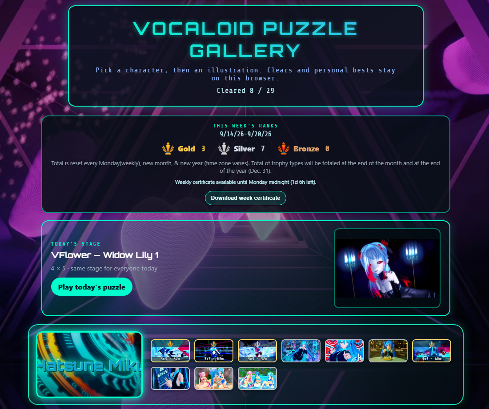
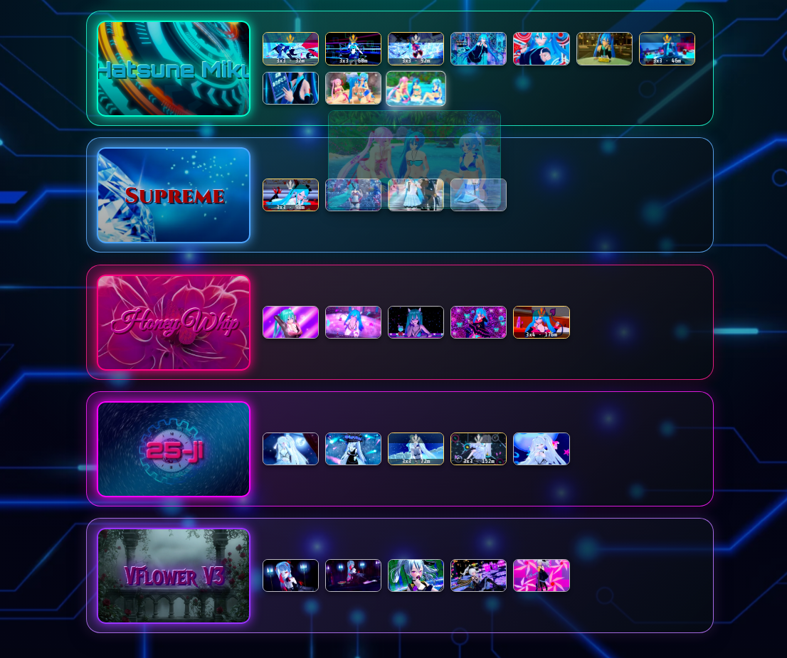
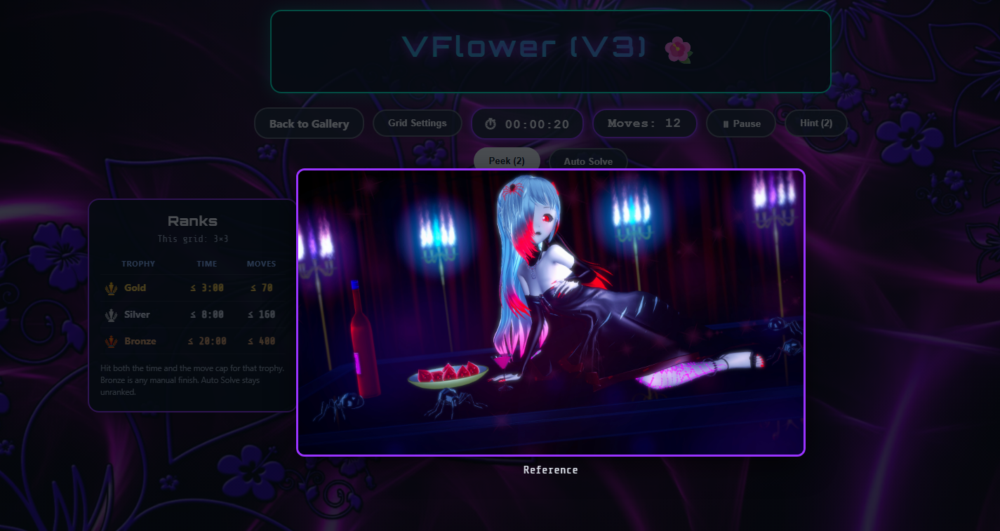
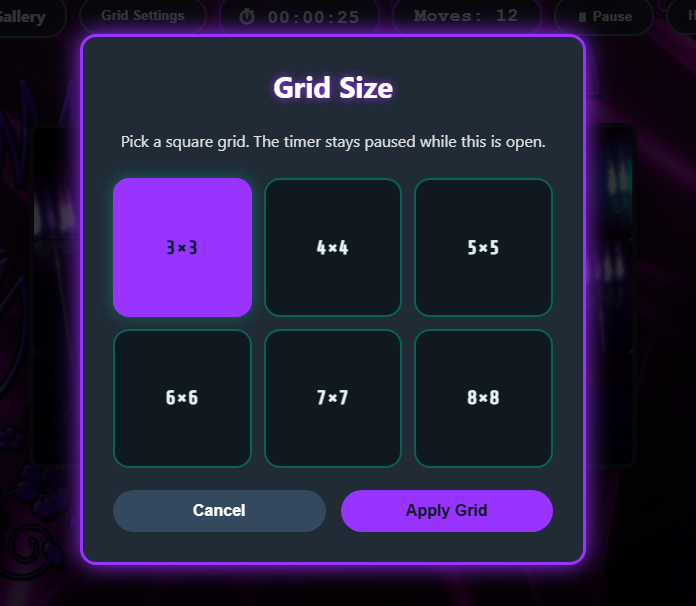
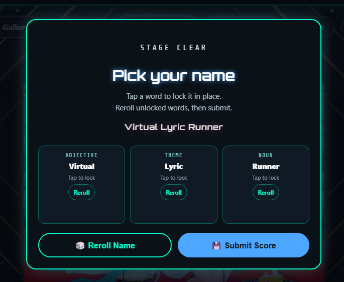
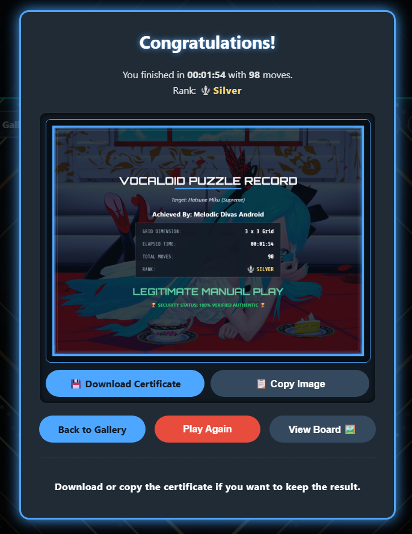
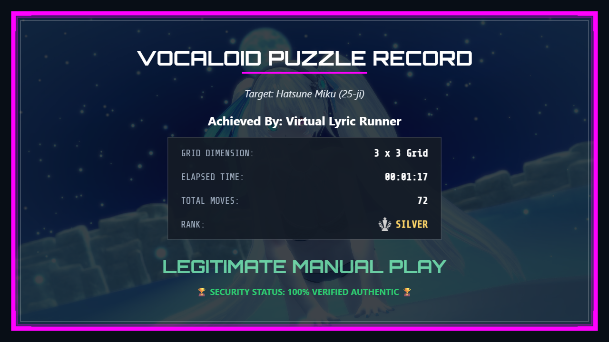
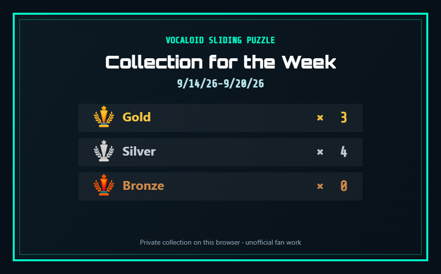

# ボーカロイド スライディングパズル

*[English version is here](README.md)*

初音ミク（いくつかのモジュール）と **ブイフラワー V3** のイラストで遊ぶ、無料・非公式のスライディングパズルです。キャラを選んで絵を選んで、崩れたタイルを元の位置に戻してください。

ブラウザだけで動きます。インストールもアカウントも広告もありません。クリア記録は、遊んだ端末のブラウザに残ります。左上の大きな **EN | 日本語** ボタンで表示言語を切り替えられます。選んだ言語はこのブラウザに記憶されます。

**プレイ:** [GitHub Pages](https://cns1700.github.io/Vocaloid-Sliding-Puzzle-/) · [itch.io](https://mizuchisylph.itch.io/vocaloid-sliding-puzzle)

## スクリーンショット

<!-- 3 rows × 3 cells. 画像は screenshots/ にあります。 -->

| | | |
|---|---|---|
|  |  |  |
| **ホーム** ギャラリー、今週のランク、今日のステージ | **パズル選択** 5キャラの横列＋ホバープレビュー | **ヒント** 盤面に番号を表示 |
|  |  |  |
| **Peek** 完成絵の参照（表示中はタイマー停止） | **グリッドサイズ** 正方形 3×3〜8×8 | **名前ピッカー** ロック／リロール／Achieved By |
|  |  |  |
| **クリア** ランク、ダウンロード、コピー | **証明書** トロフィー＋ゴールド / シルバー / ブロンズ | **週間コレクション** ダウンロードできる週次集計 |

## できること

テーマは5つです。オリジナルミク、スプリーム、ハニーホイップ、25時、ブイフラワー V3。盤面は 3×3 から 8×8 までの正方形です。ギャラリーはサイコロ型ではなく、キャラごとに横一列のリストです。スプリーム、ハニーホイップ、ブイフラワー V3 の表記はカタカナのまま変えないでください。

ホームではキャラ背景がゆっくり切り替わります。パズル画面では、そのキャラの背景のまま、光がゆるく動きます。

タイマー、手数、一時停止、番号ヒントに加えて、完成絵を出す **Peek** があります（表示中はタイマー停止）。日付が変わると **今日のステージ** も変わります。その日は、同じタイムゾーンなら全員同じイラストと正方形グリッド（3×3 / 4×4 / 5×5 / 6×6）です。

自分でクリアしたパズルはギャラリーが覚えます。サムネにトロフィーが付き、タイムと手数の自己ベストがこのブラウザに残ります。オートソルブでも盤面は揃いますが、ランクには入りません。

クリア後は結果の証明書をダウンロードしたりコピーしたりできます。手動クリアはゴールド／シルバー／ブロンズで、同じカップのトロフィーを色だけ変えて使います。オートソルブは「ランクなし」です。手動クリアのあと、証明書の **Achieved By** 用にボーカロイド寄りの名前を選べます。言語トグルが日本語なら日本語の単語、英語なら英語の単語です。ネットからは引きません。プロデューサーの名前（活動名も本名も）は出ないので、実在のボカロPが遊んだように見えません。パズル画面の横の表に、その盤面のタイムと手数の条件が出ます。今週のトロフィー数と週／月／年のコレクション証明書はホームにあります。

## 遊び方

1. ギャラリーのサムネを開くか、**今日のパズルをプレイ** を押します。
2. 空白の隣のタイルだけスライドできます。
3. 全部のタイルを正しい位置に戻せばクリアです。

操作：

- **グリッド設定** — 3×3〜8×8（開いている間はタイマー停止）
- **一時停止** — 時計を止めて盤面を隠す。リセットもここから
- **ヒント** — 番号を短時間表示（回数制限あり）
- **Peek** — 完成絵を約1秒（表示中はタイマー停止、回数制限あり）
- **オートソルブ** — ソルバーに任せる

トロフィーはこの端末の中だけの成績です。ゴールドは、そのグリッドサイズにしては速くて手数も抑えめ、という目安です。パズル横の表に条件が出ます。ホームに今週何回ずつ取ったかが出ます。

## ローカルで動かす

ビルドは不要です。`index.html` を開くか、静的サーバーでフォルダを配信してください。

## クレジット

イラストとキャラクターの権利は各権利者（Crypton Future Media、Piapro など）にあります。非公式のファン作品です。

- [magnific.com](https://magnific.com)
- [pixabay.com](https://pixabay.com)
- [Gold trophy icons created by Md Tanvirul Haque - Flaticon](https://www.flaticon.com/free-icons/gold-trophy)

画面いっぱいの背景は各セット用に選んだイラストで、窓いっぱいに広がります。実写写真ではありません。

## ライセンス

無料・非営利。公式とは無関係です。販売しないでください。

## リンク

- GitHub: https://github.com/Cns1700/Vocaloid-Sliding-Puzzle-
- X: https://x.com/MizuchiSylph

---

*シャッフル、オートソルブ、記録、サムネの話は `DEVELOPER.md` にあります。*
